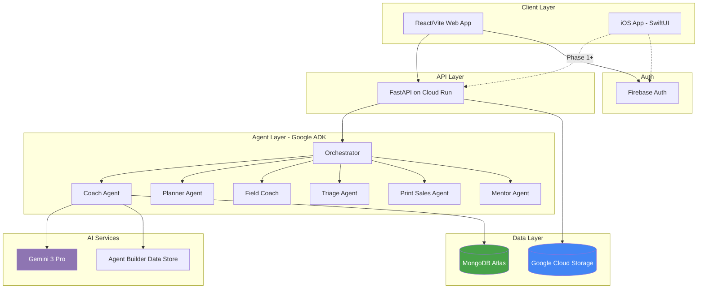
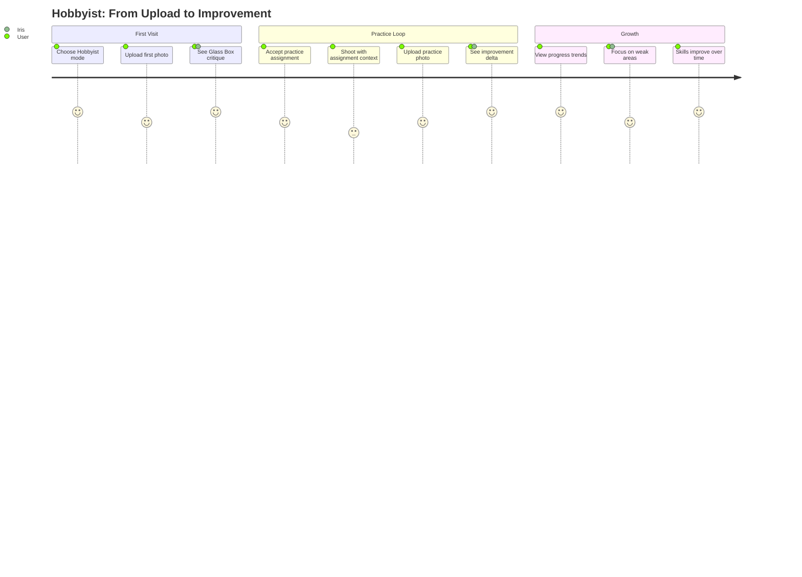
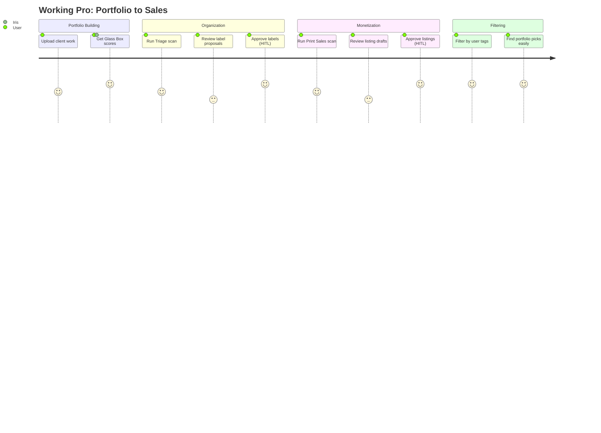
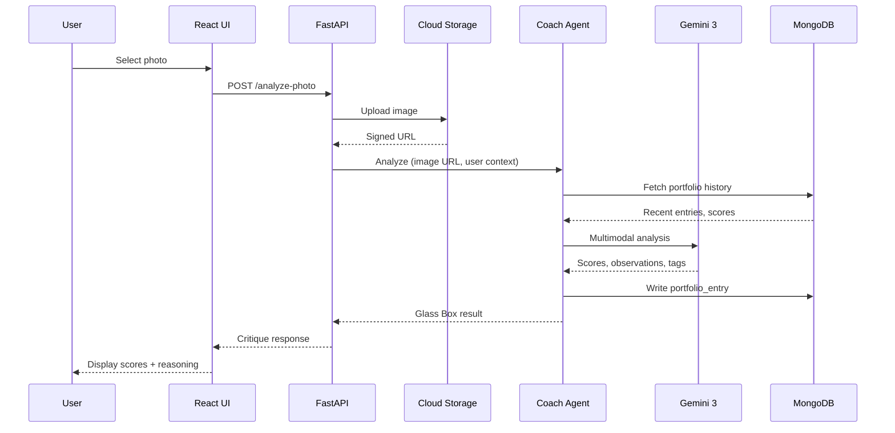

# Iris — AI Photography Mentor

<!-- Hero banner placeholder: docs/images/hero.png -->

[](https://cloud.google.com/)
[](https://ai.google.dev/)
[](https://www.mongodb.com/atlas)
[](https://firebase.google.com/)
[](https://react.dev/)
[](https://swift.org/)
[](LICENSE)

**Iris** is an AI photography mentor with persistent portfolio memory. Unlike generic photo critique tools, Iris remembers every frame you upload, tracks your growth over time, and adapts its coaching to your skill level and goals.

> *"Your composition has improved 23% since you started. You've mastered leading lines. Let's work on backlighting next."*

Built with **Gemini 3**, **Google ADK**, **MongoDB Atlas**, and **Firebase** for the [Google Cloud Rapid Agent Hackathon](https://googlecloudrapidagents2026.devpost.com/).

---

## Why Iris?

| Problem | How Iris Solves It |
|---------|-------------------|
| AI critiques forget you | **Persistent memory** — MongoDB stores every photo, score, and insight |
| Generic feedback | **Persona-based coaching** — hobbyist vs working pro vs vision-impaired |
| No skill progression | **Practice planning** — AI proposes assignments targeting weak areas |
| Black-box scores | **Glass Box reasoning** — see exactly why each score was given |
| Listing copy is tedious | **Print sales drafts** — AI writes Etsy-style listings (pros only) |

### What Iris is NOT

- **Not a photo editor** — that's Lightroom
- **Not a culling tool** — that's Aftershoot
- **Not a social platform** — no likes, followers, feeds
- **Not a workflow accelerator** — deliberately slow and thoughtful

Iris and Aftershoot coexist: Aftershoot for the cull-and-deliver pipeline, Iris for the mentor-and-evolve loop.

---

## Live Demo

| Surface | URL |
|---------|-----|
| **Web App** | [iris-photo.web.app](https://iris-photo.web.app) |
| **API Health** | `GET /health` returns `{"status": "ok"}` |

**Test flow:** Upload a photo → see Glass Box critique → accept a practice assignment → complete it → watch your scores trend upward over time.

---

## Architecture



**Key design decisions:**
- Images stored in GCS (URLs in MongoDB, not blobs)
- MCP Server for agent reads, PyMongo for writes
- Persona-based tool filtering (VI users get haptics, not visual overlays)
- Human-in-the-loop for all portfolio mutations

See [`docs/architecture.md`](docs/architecture.md) for detailed component documentation.

---

## Features by Persona

### Hobbyist

| Feature | Description |
|---------|-------------|
| **Glass Box Critique** | Upload photo → scores + reasoning + improvement tips |
| **Portfolio Memory** | Every photo saved, searchable, never forgotten |
| **Practice Assignments** | AI proposes challenges targeting your weak areas |
| **Progress Tracking** | Score trends, focus areas, skill deltas over time |
| **Mentor Chat** | Ask questions, get portfolio-aware answers |

### Working Professional

*Everything in Hobbyist, plus:*

| Feature | Description |
|---------|-------------|
| **Triage Scan** | AI groups similar photos, suggests labels |
| **Print Sales Drafts** | Etsy-style listings with title, description, price |
| **HITL Approval** | Nothing goes live without your explicit approval |
| **User Tags** | Filter portfolio by your labels ("portfolio picks", "client work") |

### Vision Impairment (Roadmap)

| Feature | Description |
|---------|-------------|
| **Voice-First Field** | Scene narration while you frame |
| **Haptic Patterns** | Vibration feedback for composition hints |
| **Audio Critique** | Spoken Glass Box summaries |
| **HITL Voice Confirm** | "Save to portfolio?" — voice response |

---

## User Journeys

### Hobbyist Journey



### Working Pro Journey



### Data Flow: Photo Upload



---

## Tech Stack

| Layer | Technology | Purpose |
|-------|------------|---------|
| **Frontend** | React 18, Vite, Tailwind CSS | Web application |
| **iOS** | SwiftUI, AVFoundation | Native camera + live coaching (in development) |
| **API** | FastAPI, Python 3.11 | REST endpoints |
| **Agents** | Google ADK, Vertex AI | Agent orchestration |
| **LLM** | Gemini 3 Pro | Multimodal reasoning |
| **Grounding** | Agent Builder Data Store | Photography principles |
| **Database** | MongoDB Atlas (Flex) | Portfolio, users, assignments |
| **Images** | Google Cloud Storage | Photo storage |
| **Auth** | Firebase Authentication | Google sign-in |
| **Hosting** | Firebase Hosting | Web app CDN |
| **API Hosting** | Cloud Run | Serverless API |

---

## Quick Start

### Prerequisites

- Python 3.11+
- Node.js 18+
- MongoDB Atlas account
- GCP project with Vertex AI enabled
- Firebase project

### Setup

```bash
# Clone
git clone https://github.com/prasadt1/photography-practice-companion.git
cd photography-practice-companion

# Environment
cp .env.example .env
# Fill in: MONGO_URI, GCP_PROJECT, GEMINI_MODEL, etc.

# MongoDB
python3 scripts/bootstrap-mongodb.py

# GCP credentials
# Place gcp-service-account.json in project root (gitignored)

# Verify Vertex AI
python3 test_vertex_ai.py

# Run locally
make api-dev          # API on :8081
make frontend-dev     # Web on :5173
make playground       # ADK UI on :8080
```

### Deployment

```bash
# Deploy API to Cloud Run
make deploy-api

# Deploy frontend to Firebase
cd frontend && npm run build && firebase deploy
```

See [`docs/deploy.md`](docs/deploy.md) for detailed deployment instructions.

---

## Cost Model

| Resource | Estimated Cost | Notes |
|----------|---------------|-------|
| **MongoDB Atlas Flex** | ~$0.10/GB/month | Scales with usage |
| **Cloud Run** | ~$0.00002/request | Free tier: 2M requests/month |
| **Gemini API** | ~$0.00025/image | Multimodal analysis |
| **Cloud Storage** | ~$0.02/GB/month | Image storage |
| **Firebase Hosting** | Free tier | 10GB storage, 360MB/day transfer |

**Per active user estimate:** ~$0.50–2.00/month depending on upload frequency.

---

## Honest Tradeoffs

| Decision | What We Chose | Why | Tradeoff |
|----------|--------------|-----|----------|
| **Image storage** | GCS URLs in MongoDB | Scalable, CDN-ready | Extra hop for retrieval |
| **Agent writes** | PyMongo (not MCP) | Richer update operations | Two access patterns |
| **Region** | europe-west3 (MongoDB) | Atlas Flex availability | Latency from US |
| **Live coaching** | Periodic frames, not 30 FPS | Cost, latency, battery | Not true real-time |
| **VI features** | Roadmap (iOS-first) | Native haptics required | Web VI limited |
| **Persona tools** | Server-side filtering | Security, consistency | Can't dynamically add tools |

---

## Roadmap

### Shipped

- [x] Glass Box critique with multimodal Gemini
- [x] Portfolio memory (MongoDB Atlas)
- [x] Practice assignments with skill tracking
- [x] Triage scan with HITL approval
- [x] Print sales drafts with HITL approval
- [x] User tags with filtering
- [x] Mentor chat with portfolio context

### In Progress

- [ ] **iOS App Phase 0** — Foundation, auth, Practice tab
- [ ] **iOS App Phase 1** — Capture-then-analyze (parity with web Field)

### Planned

- [ ] **iOS Phase 2** — Backend live coaching API
- [ ] **iOS Phase 3** — Real-time viewfinder coaching
- [ ] **iOS Phase 4** — Vision impairment: voice + haptics
- [ ] **Offline mode** — Queue uploads, coaching paused UX
- [ ] **Apple Watch** — Assignment notifications

See [`ios/README.md`](ios/README.md) for the native iOS app (Phase 0+).

---

## Documentation

Public docs: [`docs/README.md`](docs/README.md) · canonical spec: [`docs/spec.md`](docs/spec.md)

| Document | Purpose |
|----------|---------|
| [`docs/architecture.md`](docs/architecture.md) | System architecture |
| [`docs/deploy.md`](docs/deploy.md) | Deployment guide |
| [`docs/mongodb-setup.md`](docs/mongodb-setup.md) | Atlas + MCP setup |
| [`docs/decisions.md`](docs/decisions.md) | Architecture decision records |
| [`ios/README.md`](ios/README.md) | iOS (SwiftUI) setup |

---

## Repository Structure

```
photography-practice-companion/
├── app/                    # Python backend
│   ├── api/               # FastAPI routes
│   ├── memory/            # MongoDB operations
│   ├── sub_agents/        # ADK agents (Coach, Planner, etc.)
│   └── prompts/           # Agent prompts
├── frontend/              # React/Vite web app
│   ├── src/
│   │   ├── components/    # UI components
│   │   ├── services/      # API clients
│   │   └── types/         # TypeScript types
│   └── public/            # Static assets
├── ios/                   # SwiftUI iOS app (in development)
│   ├── Iris/
│   │   ├── App/          # App entry, navigation
│   │   ├── Core/         # Auth, networking, models
│   │   ├── Features/     # Field, Practice, Mentor, Settings
│   │   └── Design/       # Color tokens
│   └── Iris.xcodeproj/
├── docs/                  # Documentation
├── tests/                 # Python tests
├── scripts/               # Setup and utility scripts
└── principles/            # Photography grounding corpus
```

---

## Prior Work

UI and critique patterns extend:
- [photography-coach-ai-gemini3](https://github.com/prasadt1/photography-coach-ai-gemini3)
- [photography-coach-gemma4](https://github.com/prasadt1/photography-coach-gemma4)

This repository is a **new** multi-agent product with MongoDB memory and practice planning.

---

## License

Apache-2.0 — see [LICENSE](LICENSE).

---

## Acknowledgments

Built for the [Google Cloud Rapid Agent Hackathon](https://googlecloudrapidagents2026.devpost.com/) (MongoDB track).

Special thanks to the ADK, Gemini, and MongoDB Atlas teams for excellent documentation and tooling.
