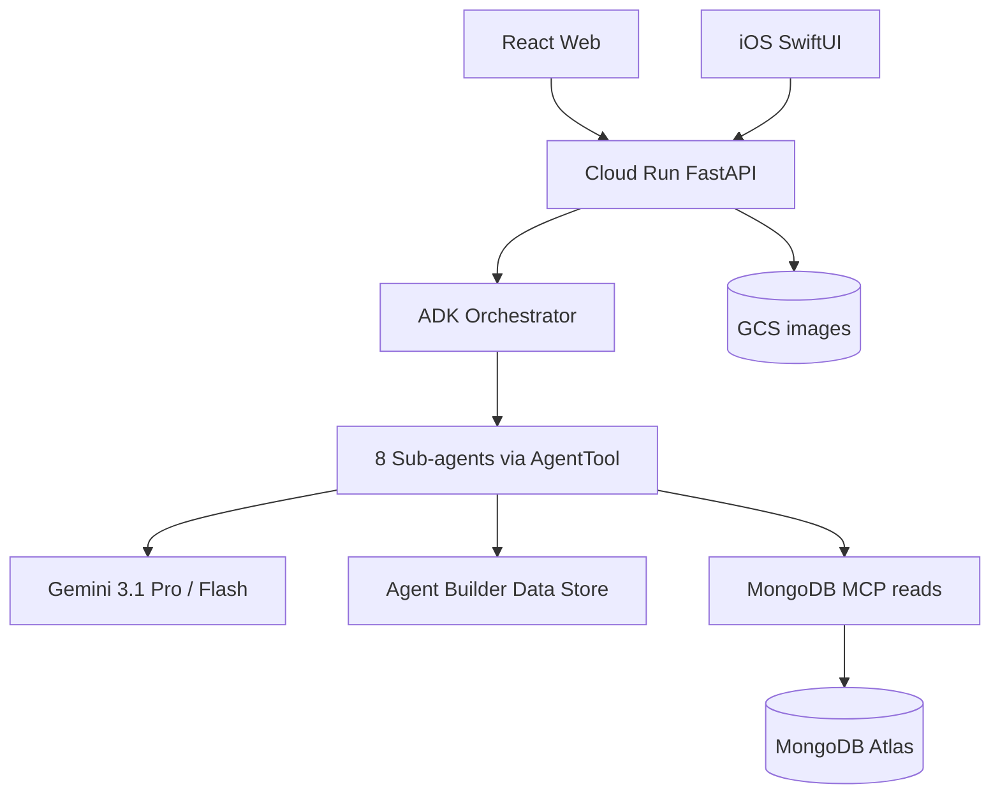

# Iris — Hackathon compliance & architecture map

**Track:** [Google Cloud Rapid Agent Hackathon](https://googlecloudrapidagents2026.devpost.com/) — **MongoDB partner**  
**Product:** Iris — AI photography mentor with persistent portfolio memory  
**Last updated:** June 2026

This document maps the official hackathon phases and judging expectations to what Iris ships today. Use it for Devpost, judge walkthroughs, and repo navigation.

---

## Live URLs

| Surface | URL |
|---------|-----|
| **Web app** | https://iris-photo-mentor.web.app |
| **Marketing landing** | https://prasadt1.github.io/iris-photography-mentor/ |
| **API health** | https://practice-companion-api-l6kusl5xcq-uc.a.run.app/health |
| **MongoDB MCP** | https://mongodb-mcp-l6kusl5xcq-uc.a.run.app/mcp |
| **Repository** | https://github.com/prasadt1/iris-photography-mentor |

---

## Phase-by-phase compliance

### Phase 1 — Core frameworks & environment

| Requirement | Status | Evidence |
|-------------|--------|----------|
| Gemini Enterprise / Vertex AI | ✅ | `genai.Client(vertexai=True)`; Gemini 3.1 Pro (`global`) + Flash for live field cues |
| Agent SDK (Python) | ✅ | `google-adk>=1.15.0`; 9 `LlmAgent` instances with `AgentTool` delegation |
| Google Cloud project | ✅ | `practice-companion-hackathon` |

**Code:** [`app/agent.py`](../app/agent.py) · [`app/sub_agents/`](../app/sub_agents/) · [ADK docs](https://google.github.io/adk-docs/)

---

### Phase 2 — Action mechanisms & data connectivity

| Requirement | Status | Evidence |
|-------------|--------|----------|
| Tool use / extensions | ✅ | 30+ `FunctionTool`s across sub-agents; orchestrator `AgentTool` delegation |
| Agent Builder Data Store | ✅ | Discovery Engine grounding for photography principles (`app/tools/grounding.py`) |
| Knowledge & grounding | ✅ | Coach + Mentor cite principles; local `principles/*.md` fallback |

**Code:** [`app/sub_agents/_toolsets.py`](../app/sub_agents/_toolsets.py) · [`principles/`](../principles/)

---

### Phase 3 — Partner integration (MongoDB)

| Requirement | Status | Evidence |
|-------------|--------|----------|
| MongoDB Atlas operational memory | ✅ | Portfolio, users, assignments, HITL, capture sessions |
| Atlas Vector Search | ✅ | Similar photos (`portfolio_entries.embedding`) |
| Atlas Search + NL queries | ✅ | Gemini query expansion → Glass Box text search |
| MongoDB MCP Server | ✅ | Cloud Run sidecar; production reads via `mcp_reads.py` |
| Embeddings on portfolio | ✅ | Vertex multimodal embeddings stored in Atlas |

**Verify:** `./scripts/verify_mcp_in_production.sh` · **Story:** [`mongodb-story-document.md`](mongodb-story-document.md) (if present) or [`architecture.md`](architecture.md)

---

### Phase 4 — Reasoning, state & logic hosting

| Requirement | Status | Evidence |
|-------------|--------|----------|
| Managed orchestration | ✅ | ADK `Runner` on Cloud Run (`orchestrator_service.py`) |
| Agent Runtime scaffold | ⚠️ | `agent_runtime_app.py` + deploy script — **not** judge-facing production path |
| Persistent state | ✅ | MongoDB for portfolio, assignments, persona, HITL |
| Chat session state | ⚠️ | ADK `InMemorySessionService` — per-instance; client passes `sessionId` |
| Secret Manager | ✅ | `MONGODB_URI` in GCP Secret Manager; `--set-secrets` on deploy |

**Honest note:** Demo API is **FastAPI on Cloud Run**, not Vertex Agent Engine. Agent Engine is ready for production cutover.

---

### Phase 5 — Deployment & safety

| Requirement | Status | Evidence |
|-------------|--------|----------|
| Cloud Run backend | ✅ | `practice-companion-api` (us-central1) |
| Web deployment | ✅ | Firebase Hosting — `iris-photo-mentor.web.app` |
| iOS native app | ✅ | SwiftUI app in [`ios/`](../ios/) |
| Safety settings | ✅ | Explicit `SafetySetting` on all Gemini `GenerateContentConfig` calls (`app/core/safety.py`) |
| Prompt guardrails | ✅ | Safety sections in all agent prompts |
| Architectural HITL | ✅ | Assignments, organize, print listings, deletes require explicit approval |
| Persona tool filtering | ✅ | Forbidden agents omitted from orchestrator tool list (not prompt-only) |

**Deploy:** [`deploy.md`](deploy.md)

---

## Judging criteria mapping

Official Devpost criteria are typically weighted across four areas. Iris maps as follows:

### Technological implementation

| Claim | Proof |
|-------|-------|
| 9 distinct ADK `LlmAgent`s | `scripts/phase0-verify.sh` |
| Persona-filtered tool lists | `build_persona_filtered_tool_list()` + `tests/test_persona_isolation.py` |
| MCP-primary production reads | `mcp_reads.py`, Cloud Trace spans, verify script |
| Multimodal structured output | Coach JSON schema, field capture Pydantic cues |
| Multi-service deploy | Cloud Run API + MCP + Firebase + Atlas + GCS |

### Design

| Claim | Proof |
|-------|-------|
| Glass Box transparency | Scores + observations + spatial hints in Studio / iOS |
| HITL as visible UI | Pending approvals, accept/decline cards, organize history |
| Photography aesthetic | Darkroom palette, film grain, photo mat motifs, Newsreader + DM Sans |
| Mobile field coaching | iOS horizon guide, live cues, graduation to “shoot now” |
| Accessibility architecture | VI persona changes sub-agent composition (Visual Describer in, Triage out) |

### Potential impact

| Claim | Proof |
|-------|-------|
| Longitudinal mentorship vs one-shot graders | Portfolio memory, trends, ISAR reflection |
| Hobbyist + working pro paths | Persona modes, Print Sales, practice loops |
| Complement-not-competitor | XMP export; mentor-and-evolve vs cull-and-deliver |

### Quality of idea

| Claim | Proof |
|-------|-------|
| Persistent aesthetic identity | `aesthetic_profile`, assignment arcs, Mentor synthesis |
| MongoDB as unified memory substrate | Documents + vectors + search + MCP in one Atlas cluster |

---

## Hackathon submission requirements

| Deliverable | Status | Notes |
|-------------|--------|-------|
| Hosted project URL | ✅ | https://iris-photo-mentor.web.app |
| Public repo + OSS license | ✅ | Apache-2.0 |
| ~3 min demo video | ⏳ | Script: [`demo-video-script-3min.md`](demo-video-script-3min.md) |
| Partner track = MongoDB | ⏳ | Select on Devpost submit |
| Completed Devpost form | ⏳ | Copy from [`devpost-draft.md`](devpost-draft.md) |

### Core goals (qualification)

| Goal | Met? | Demo beat (~3 min) |
|------|------|-------------------|
| Real-world challenge | ✅ | Photographer growth over time |
| Beyond chat — tools that act | ✅ | Upload → critique → persist; Planner; Triage; Field Coach |
| Multi-step mission + user control | ✅ | Orchestrator routing + HITL gates |
| Gemini reasoning | ✅ | Coach, Mentor, Planner, Reflection |
| Agent Builder grounding | ✅ | Principles Data Store in Glass Box |
| Partner MCP superpower | ✅ | MCP verify script / Cloud Trace |

---

## Multi-agent architecture (9 LlmAgents)

| Agent | Role | Persona availability |
|-------|------|---------------------|
| **Orchestrator** | Intent routing, persona-filtered tools | Always |
| **Coach** | Glass Box critique + grounding | All |
| **Mentor** | Portfolio Q&A, synthesis | All |
| **Planner** | Practice assignment proposals | All |
| **Reflection** | Post-assignment ISAR / skill delta | All |
| **Field Coach** | Live capture cues | All |
| **Triage** | Organize: tags, dedupes (HITL) | Hobbyist + working pro |
| **Print Sales** | Listing drafts (HITL) | Working pro only |
| **Visual Describer** | VI scene narration | Vision impairment only |

**Deep dive:** [`architecture.md`](architecture.md) · [`diagrams/`](diagrams/)

---

## Honesty checklist (do not over-claim)

| Topic | Say this | Not this |
|-------|----------|----------|
| Production host | Cloud Run FastAPI | “Agent Engine serves production” |
| Change streams | On-read aesthetic profile derivation | “Live change-stream pipeline” |
| iOS overlays | Rule-of-thirds grid + CoreMotion horizon | “ARKit overlays” |
| VI on iPhone | Agent layer + tests; iOS UI roadmap | “Shipped haptics on iPhone” |
| MCP reads | MCP-primary reads; PyMongo for writes | “Every operation goes through MCP” |
| Mentor chat sessions | In-memory per Cloud Run instance | “Durable cross-restart sessions” |

---

## Related documentation

| Doc | Purpose |
|-----|---------|
| [`architecture.md`](architecture.md) | Components, data flows, security |
| [`deploy.md`](deploy.md) | Cloud Run + Firebase + Secret Manager |
| [`decisions.md`](decisions.md) | ADRs (regions, MCP vs PyMongo, storage) |
| [`spec.md`](spec.md) | Master specification |
| [`implementation-and-hackathon-mapping.md`](implementation-and-hackathon-mapping.md) | Feature inventory (may lag; this doc is judge-facing) |
| [`../ios/README.md`](../ios/README.md) | Native iOS app |
| [`../README.md`](../README.md) | Project overview |

---

## Suggested judge flow (3–5 min)

1. **Home / Studio** — upload → Glass Box critique (0:20–0:50)
2. **Practice** — accept assignment → shoot via Field (0:40–1:10)
3. **Mentor** — Organize → approve one card → history (1:10–1:30)
4. **My Work** — NL search + similar photos (1:30–1:50)
5. **iOS** — horizon guide + live coach (1:50–2:15)
6. **MCP proof** — `./scripts/verify_mcp_in_production.sh` or Cloud Trace screenshot (2:20–2:35)

**Video script:** [`demo-video-script-3min.md`](demo-video-script-3min.md)
